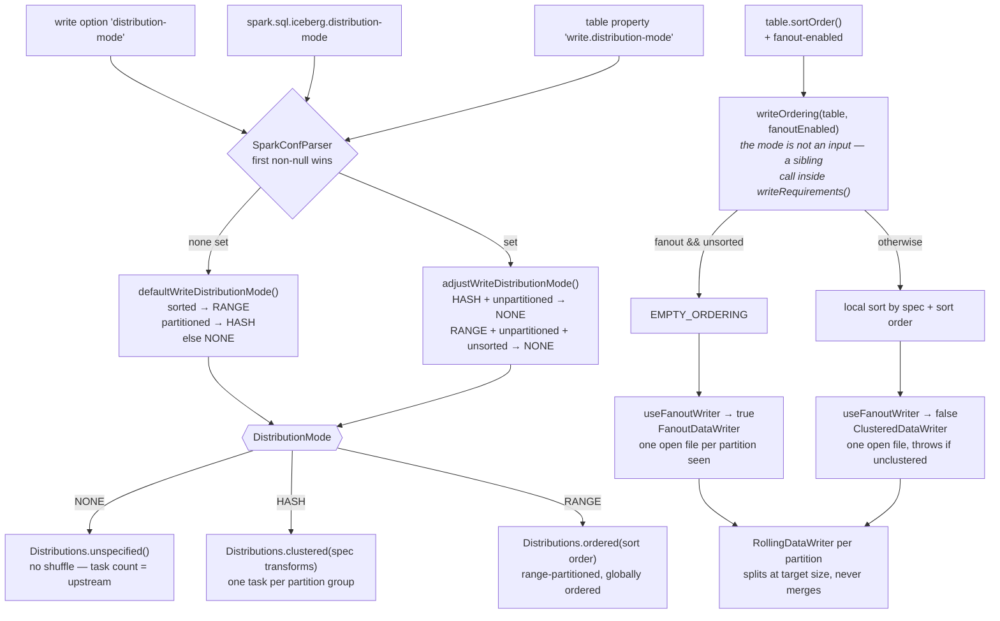

# Chapter 11.3 — The write path in Spark: distribution mode and the small-file problem

<div class="chapter-meta" markdown>
**The question this chapter answers:** a single `INSERT` produced forty thousand files — which line of Iceberg's Spark integration decided that, and which knob addresses that particular cause rather than a different one?

**Prerequisites:** Chapter 5.1 (the writer family), Chapter 2.4 (why a small file costs a manifest entry and a metrics blob), Chapter 11.1 (which catalog you are writing through)

**Source covered:** `spark/v3.5/.../spark/SparkWriteConf.java`, `.../spark/SparkWriteUtil.java`, `.../spark/source/SparkWrite.java`, `core/.../io/RollingFileWriter.java`, `core/.../io/ClusteredWriter.java`, `core/.../io/FanoutWriter.java`
</div>

## 1. The problem

Start with arithmetic instead of configuration, because the arithmetic is what the code implements.

A Spark write is N tasks running in parallel. Each task receives some rows, and for every distinct partition value in those rows it must open a file in that partition — a file cannot span two partitions. So the number of data files a write produces is at least the number of distinct **(task, partition)** pairs that the physical plan hands to the writers.

That number is fixed before a single byte is written. Nothing downstream of it can shrink it, because Iceberg's writers have no mechanism for producing *fewer* files than they are asked for. They can only split.

So there are exactly two factors to attack, and they live in different places:

1. **How many tasks see rows for a given partition.** Decided by the shuffle, which `write.distribution-mode` requests.
2. **What one task does with the partitions it sees.** Decided by clustered versus fanout writers, which changes whether that work costs a local sort or heap.

Reaching for the second when the problem is the first — or reaching for `write.target-file-size-bytes`, which on this path addresses neither — is the most common Iceberg write-tuning mistake. The code says exactly which is which. (That property is not inert everywhere: off this path it is the compaction target, which §7 comes back to.)

## 2. From write options down to a writer



One edge in that diagram is counter-intuitive and worth naming now: the **ordering** decision is made first, and the **writer** choice is read back off it. `SparkWriteConf.writeRequirements()` calls `SparkWriteUtil.writeRequirements(table, distributionMode(), fanoutWriterEnabled(), …)` with a provisional fanout default of `true`; the resulting `SparkWriteRequirements` is then handed to `useFanoutWriter`. Sorted table ⇒ an ordering is requested ⇒ clustered writer. Unsorted table ⇒ no ordering ⇒ fanout writer.

## 3. The bottom of the stack only rolls up

Before any knob, establish what the writer at the very bottom can and cannot do.



Three lines, and they are the whole ceiling story. `RollingFileWriter.write` calls this after every row and, when it returns true, closes the current file and opens a new one. There is no inverse: no method combines two undersized files, and no code path defers closing a file in the hope of more rows. Note what the comparison is against: `targetFileSizeInBytes`, a field the writer was constructed with. This method reads no property. The value reached it from `SparkWriteConf.targetDataFileSize()`, which is where `write.target-file-size-bytes` (default `WRITE_TARGET_FILE_SIZE_BYTES_DEFAULT`, 512 MB) enters the write path — and all it can do once here is end a file *early*.

Every writer ends its files at end-of-task regardless of size. So if a task holds 12 KB of rows for a partition, it writes a 12 KB file, and raising the target file size changes nothing about that.

Note also `currentFileRows % ROWS_DIVISOR == 0`, with `ROWS_DIVISOR = 1000`. Length is sampled once per thousand rows, because `currentWriter.length()` is not free. Files routinely overshoot the target by whatever the last thousand rows weighed.

## 4. Factor one: how many tasks see a partition

This is the factor that matters, and Iceberg picks it for you when you have not.



Read what this is derived from: `table.sortOrder()` and `table.spec()`. Table state, not configuration. A partitioned table gets `HASH` — a shuffle that clusters rows by the spec's transforms, so that all rows for one partition arrive at one task and the (task, partition) count collapses to roughly the partition count. Which transforms those are is a real choice with a read-side cost attached: Chapter 2.6 §4 shows why a `bucket` field prunes point lookups and never a range.

That shuffle is why a plain `INSERT` into a partitioned table is slower than the same `INSERT` into an unpartitioned one, and it is exactly what `write.distribution-mode=none` turns off. Turn it off and every upstream task contributes a file to every partition it happens to hold rows for; the multiplication is the file explosion.

The reverse direction has a trap in it:



An explicitly requested mode goes through this before it is used. `HASH` on an unpartitioned table becomes `NONE`; `RANGE` on a table that is both unpartitioned and unsorted becomes `NONE`. No warning is logged and no exception is raised, because there is genuinely nothing to cluster on. But a job sized around a shuffle that never happened is a real diagnosis, and this method is where that possibility lives.

The precedence is fixed by `SparkWriteConf`'s class javadoc: write options, then session configuration, then table metadata. Note the asymmetry — `distributionMode()` consults all three, while `fanoutWriterEnabled()` consults only the write option and the table property. There is no `spark.sql.iceberg.fanout-enabled`.

What each mode becomes is one switch:



`clustering(table)` is `Spark3Util.toTransforms(table.spec())` — the partition transforms and nothing else. `ordering(table)` is `Spark3Util.toOrdering(SortOrderUtil.buildSortOrder(table))`, which prepends the spec's fields to the declared sort order. So `HASH` asks for a hash shuffle on the partition values, while `RANGE` asks for a range shuffle that also orders rows within each task. `RANGE` therefore costs a sampling pass and a global sort, and buys sorted output that makes the read-side pruning of Chapter 4.3 effective. `HASH` costs one shuffle and buys only the file-count collapse. A table with no declared sort order gets no benefit from the extra cost, which is why `defaultWriteDistributionMode` reaches for `RANGE` only when `table.sortOrder().isSorted()`.

## 5. Factor two: what one task does with its partitions

Once the shuffle has decided which partitions land in a task, the task must write them. Two writers exist for it, and upstream states the choice in a comment above the method that makes it:



> *a local ordering within a task is beneficial in two cases: there is a defined table sort order, so it is clear how the data should be ordered; the table is partitioned and fanout writers are disabled, so records for one partition must be co-located within a task.*

That is the guideline, in upstream's own words, and it is a statement about *requirement*, not preference. A clustered writer does not work on unclustered input, so if you want one, the plan has to sort.



`boolean defaultValue = !writeRequirements.hasOrdering();` — the writer default is derived from whether an ordering was requested. `TableProperties.SPARK_WRITE_PARTITIONED_FANOUT_ENABLED_DEFAULT` is `false`, but that constant is never consulted on this path; it is only the fallback when nothing supplies a default. On an unsorted partitioned table, `writeOrdering` returns `EMPTY_ORDERING`, so `hasOrdering()` is false and **fanout writers are on**.

What each writer costs is visible in its own class. `FanoutWriter` holds a `Map<Integer, StructLikeMap<FileWriter<T, R>>>` and closes nothing until `close()`; its javadoc says the consequence plainly — it *"may potentially consume substantially more memory compared to `ClusteredWriter`. Use this writer only when clustering by spec/partition is not possible (e.g. streaming)."* A task touching 500 partitions holds 500 open Parquet writers, each with a row-group buffer.

`ClusteredWriter` is the other trade, and it enforces its assumption rather than trusting it:



Forty-one lines, but the argument is in six of them. On a partition change the writer calls `closeCurrentWriter()` and adds the old partition to `completedPartitions`; then:

```java
if (completedPartitions.contains(partition)) {
  String errorCtx =
      String.format("partition '%s' in spec %s", spec.partitionToPath(partition), spec);
  throw new IllegalStateException(NOT_CLUSTERED_ROWS_ERROR_MSG_TEMPLATE + errorCtx);
}
```

A partition that reappears after its file was closed is a hard failure — *"Incoming records violate the writer assumption that records are clustered by spec and by partition within each spec. Either cluster the incoming records or switch to fanout writers."* Iceberg refuses to silently reopen the partition and write a second file for it, which is the behaviour that would quietly reintroduce the small-file problem the clustered writer exists to avoid.

So the two writers do not change the file count. They change what the file count costs you: fanout pays in executor heap, clustered pays in a local sort and fails loudly if it does not get one.

## 6. Diagnosis

| Symptom | Which factor | Knob, and what it costs |
|---|---|---|
| Many small files, partitioned table, `distribution-mode=none` | tasks × partitions | set `write.distribution-mode=hash`; costs one shuffle |
| Many small files, `hash` already set | Spark split the clustered shuffle wider than the partition count | `write.spark.advisory-partition-size-bytes` — Iceberg's only lever here, and it is inert under `none`; see the note below |
| Executor OOM on a wide-partition write | fanout writer holding N files open | `fanout-enabled=false` plus a sort order, or narrow the partition spec |
| `IllegalStateException: … records are clustered by spec` | clustered writer, unsorted input | re-enable fanout, or add the distribution and ordering back |
| Files noticeably larger than the target | 1000-row sampling in `shouldRollToNewFile` | expected behaviour, not a bug |
| Files already small on disk | neither — the write is over | `rewrite_data_files` (Chapter 11.5) |

## 7. Gotchas

!!! warning "Target file size cannot make files bigger — but it does move the compaction target"
    On the write path the property reaches exactly one comparison. `SparkWriteConf.targetDataFileSize()` reads it, hands the value to the writers, and `shouldRollToNewFile` only ever uses it to end a file *early*. Raising it to fix small files does nothing, because every writer already stops at end-of-task well below the target. The knob that changes file *count* is `write.distribution-mode`; the knob that fixes files already written is `rewrite_data_files`.

    It has two other readers, and neither is on the write path: `BinPackRewriteFilePlanner.defaultTargetFileSize()` and `BaseRewriteDataFilesAction`. There it is the **compaction** target, and everything derived from it moves with it — the selection window and the group thresholds of Chapter 11.5 §3. So this property is not the no-op it looks like from here. It changes nothing about the files this write produces, and it changes which files compaction later selects and how large it rebuilds them. Raise it for the second reason, not the first.

!!! warning "`distribution-mode=hash` on an unpartitioned table is silently ignored"
    `adjustWriteDistributionMode` returns `NONE` for `HASH` on an unpartitioned spec, and for `RANGE` on a spec that is both unpartitioned and unsorted. No warning, no exception. Confirm the table is actually partitioned before concluding the mode had no effect for some other reason.

!!! warning "Fanout writers trade files for heap, and the heap is per task"
    `FanoutWriter` keeps one open file per (spec, partition) pair it has ever seen and closes them all in `close()`. This is the executor OOM that follows from turning the distribution mode off "for speed": no shuffle means every task sees every partition, and fanout is the default writer for an unsorted table, so every task opens a file in every partition and holds it.

!!! warning "Fanout is the default for unsorted partitioned tables in this release"
    `useFanoutWriter` supplies `!writeRequirements.hasOrdering()` as the default, and `writeOrdering` returns an empty ordering when the table has no sort order. The `SPARK_WRITE_PARTITIONED_FANOUT_ENABLED_DEFAULT = false` constant does not apply here. Advice written against older releases claiming fanout is off by default should be re-checked against this method.

!!! warning "`use-table-distribution-and-ordering=false` also selects the fanout writer"
    `writeRequirements()` short-circuits to `SparkWriteRequirements.EMPTY` when that option is set, logging only *"Skipping distribution/ordering: disabled per job configuration"*. `EMPTY` has no ordering, so unless `fanout-enabled` is set explicitly, `useFanoutWriter` returns `true`. Disabling Iceberg's distribution therefore removes the shuffle *and* switches the writer, which is two changes from one option.

!!! note "The advisory partition size is derived from 128 MB, not from the target file size"
    `SparkWriteConf.dataAdvisoryPartitionSize()` starts from the private constant `DATA_FILE_SIZE = 128 * 1024 * 1024`, scales it by an estimated shuffle-compression ratio, and takes the max against Spark's own `spark.sql.adaptive.advisoryPartitionSizeInBytes`. Raising `write.target-file-size-bytes` does **not** move the AQE coalescing target; `write.spark.advisory-partition-size-bytes`, `spark.sql.iceberg.advisory-partition-size` or the `advisory-partition-size` write option does. This is the second-order reason the target-file-size knob so often appears to do nothing.

    It is also the *only* lever Iceberg has on how wide the shuffle gets. Iceberg does not choose the number of shuffle partitions and reads no Spark property that sets one; it reports a `SparkWriteRequirements` — a distribution, an ordering, an advisory partition size — and Spark's AQE decides the rest. That object has a trap in its constructor: it replaces the advisory size with `NO_ADVISORY_PARTITION_SIZE` whenever the distribution is an `UnspecifiedDistribution`, commented *"Spark prohibits requesting a particular advisory partition size without distribution"*. So `distribution-mode=none` does not just remove the shuffle. It silently disables the one sizing knob you would reach for next.

!!! note "Where the writer is finally chosen"
    `SparkWrite.WriterFactory.createWriter` returns an `UnpartitionedDataWriter` for an unpartitioned spec and a `PartitionedDataWriter` otherwise, and the latter's constructor is a single branch on the `useFanoutWriter` boolean computed back in `SparkWrite`'s constructor. Both delegate to `RollingDataWriter` per partition. If you need to confirm which writer a job actually used, that constructor is the place the decision becomes visible.

## Key takeaways

- The file count is decided by *tasks × partitions-per-task*, before any byte is written. `RollingFileWriter` only splits files; nothing in the write path merges them.
- `write.target-file-size-bytes` is a ceiling on the write path, sampled every 1000 rows. It cannot make small files bigger and it does not move the AQE advisory partition size. Its other two readers are compaction planners, where the same value is the *output* size — so raising it is a change to what `rewrite_data_files` builds and selects (Chapter 11.5 §3), not to this write.
- `write.distribution-mode` is the only knob that changes the first factor. Iceberg picks it from table state when you do not: sorted ⇒ `RANGE`, partitioned ⇒ `HASH`, otherwise `NONE`.
- An explicitly set `HASH` or `RANGE` can be silently downgraded to `NONE` by `adjustWriteDistributionMode` when there is nothing to cluster on.
- Fanout versus clustered does not change the file count; it changes whether a task pays in heap or in a local sort. On an unsorted partitioned table, fanout is the default in this release.
- `ClusteredWriter` throws rather than reopening a closed partition, which is why disabling fanout without supplying an ordering fails the job instead of quietly writing more files.

## Source map

| What | File |
| --- | --- |
| Config precedence and every write knob | [`spark/v3.5/.../spark/SparkWriteConf.java`](https://github.com/apache/iceberg/blob/apache-iceberg-1.11.0/spark/v3.5/spark/src/main/java/org/apache/iceberg/spark/SparkWriteConf.java) |
| Distribution and ordering construction | [`spark/v3.5/.../spark/SparkWriteUtil.java`](https://github.com/apache/iceberg/blob/apache-iceberg-1.11.0/spark/v3.5/spark/src/main/java/org/apache/iceberg/spark/SparkWriteUtil.java), [`.../SparkWriteRequirements.java`](https://github.com/apache/iceberg/blob/apache-iceberg-1.11.0/spark/v3.5/spark/src/main/java/org/apache/iceberg/spark/SparkWriteRequirements.java) |
| Option and session-property names | [`spark/v3.5/.../spark/SparkWriteOptions.java`](https://github.com/apache/iceberg/blob/apache-iceberg-1.11.0/spark/v3.5/spark/src/main/java/org/apache/iceberg/spark/SparkWriteOptions.java), [`.../SparkSQLProperties.java`](https://github.com/apache/iceberg/blob/apache-iceberg-1.11.0/spark/v3.5/spark/src/main/java/org/apache/iceberg/spark/SparkSQLProperties.java) |
| Writer selection per task | [`spark/v3.5/.../spark/source/SparkWrite.java`](https://github.com/apache/iceberg/blob/apache-iceberg-1.11.0/spark/v3.5/spark/src/main/java/org/apache/iceberg/spark/source/SparkWrite.java) |
| The two partitioning writers | [`core/.../io/ClusteredWriter.java`](https://github.com/apache/iceberg/blob/apache-iceberg-1.11.0/core/src/main/java/org/apache/iceberg/io/ClusteredWriter.java), [`core/.../io/FanoutWriter.java`](https://github.com/apache/iceberg/blob/apache-iceberg-1.11.0/core/src/main/java/org/apache/iceberg/io/FanoutWriter.java) |
| Rolling by target size | [`core/.../io/RollingFileWriter.java`](https://github.com/apache/iceberg/blob/apache-iceberg-1.11.0/core/src/main/java/org/apache/iceberg/io/RollingFileWriter.java) |
| Defaults | [`core/.../TableProperties.java`](https://github.com/apache/iceberg/blob/apache-iceberg-1.11.0/core/src/main/java/org/apache/iceberg/TableProperties.java) |

**Next:** Chapter 11.4 takes the same `SparkWriteUtil` machinery into row-level operations, where `MERGE INTO` adds `_spec_id`, `_partition` and `_file` to the clustering — and where losing a commit race costs the entire job rather than a retry.
