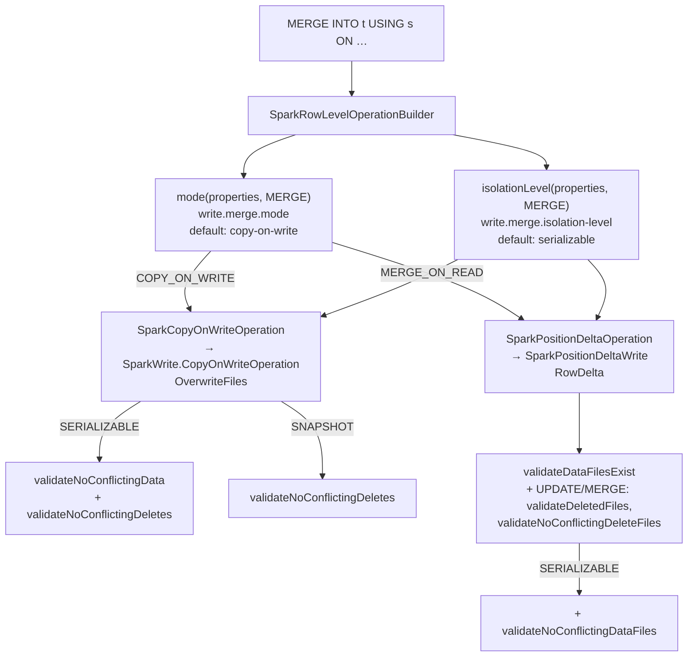
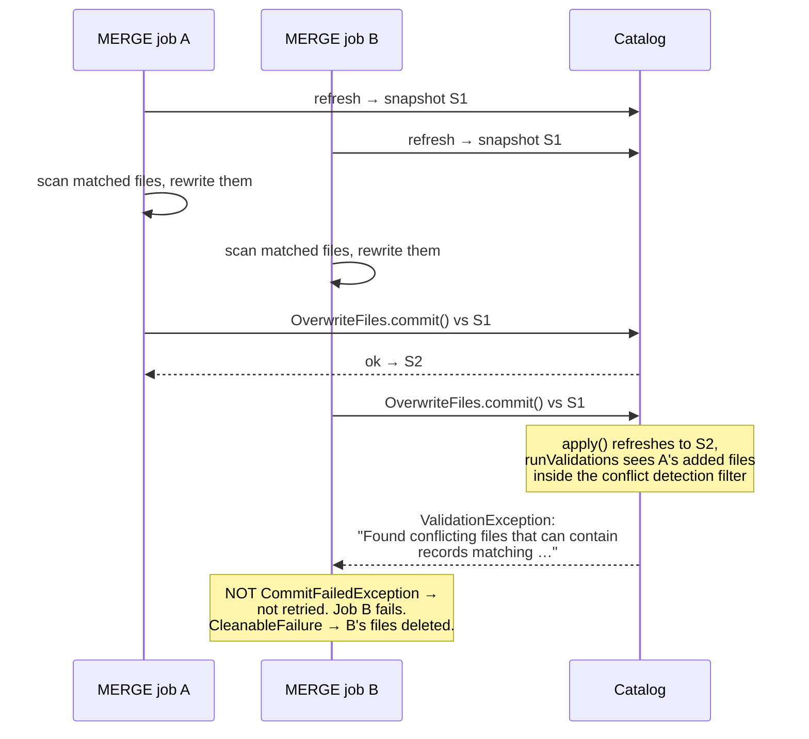

# Chapter 11.4 — `MERGE INTO`, row-level operations, and commit conflicts

**The question this chapter answers:** two `MERGE INTO` jobs run against the same table at the same time — which one fails, what exception does the loser see, and which table property decided that outcome?

**Prerequisites:** Chapter 5.4 (what copy-on-write and merge-on-read actually write), Chapter 5.3 (position deletes and `RowDelta`), Chapter 3.5 (the validators), Chapter 3.3 (the retry loop), Chapter 11.3 (distribution mode)

**Source covered:** `spark/v3.5/.../spark/source/SparkRowLevelOperationBuilder.java`, `.../source/SparkWrite.java`, `.../source/SparkPositionDeltaWrite.java`, `.../spark/SparkWriteUtil.java`, `api/.../exceptions/ValidationException.java`

## 1. The problem

`MERGE INTO` reads like one operation. It is not one code path. Spark asks the table for a `RowLevelOperationBuilder`, and Iceberg answers by reading **two table properties** and building one of four combinations: copy-on-write or merge-on-read, crossed with serializable or snapshot isolation. The properties are read once, in a constructor, before the plan is built. Nothing in the SQL mentions them.

Chapters 5.3 and 5.4 own what those writers do to files. This chapter is about the other half — what happens when two of these jobs overlap — and it turns on one asymmetry that is easy to miss.

Chapter 3.3 established that `SnapshotProducer.commit()` retries on `CommitFailedException` and on nothing else. A merge that loses a conflict does not raise `CommitFailedException`. It raises `ValidationException`. So the loser does not back off and try again: it fails the Spark job, having already scanned the table and written every output file. That asymmetry, not the copy-on-write/merge-on-read distinction, is what makes concurrent merges expensive.

## 2. The 2 × 2, and where it is decided



One property per command, each with its own default, all read from `table.properties()`. `DELETE_MODE_DEFAULT`, `UPDATE_MODE_DEFAULT` and `MERGE_MODE_DEFAULT` are all `RowLevelOperationMode.COPY_ON_WRITE.modeName()` in this release — so an untouched table does copy-on-write for all three commands. The sibling `isolationLevel(properties, command)` has the identical shape, and `DELETE_ISOLATION_LEVEL_DEFAULT`, `UPDATE_ISOLATION_LEVEL_DEFAULT` and `MERGE_ISOLATION_LEVEL_DEFAULT` are all the string `"serializable"`.

Six properties govern the three commands, and they are independent of each other:

| Command | Writer | Isolation | Shuffle |
|---|---|---|---|
| `DELETE FROM` | `write.delete.mode` (`copy-on-write`) | `write.delete.isolation-level` (`serializable`) | `write.delete.distribution-mode` |
| `UPDATE` | `write.update.mode` (`copy-on-write`) | `write.update.isolation-level` (`serializable`) | `write.update.distribution-mode` |
| `MERGE INTO` | `write.merge.mode` (`copy-on-write`) | `write.merge.isolation-level` (`serializable`) | `write.merge.distribution-mode` |

Setting `write.merge.mode=merge-on-read` does nothing for `DELETE FROM` on the same table. Tables configured for merge-on-read one command at a time are a common source of "why is this one slow" — and the answer is a property nobody set.

Both are captured in the builder's constructor and `build()` is a two-way switch on `mode`. There is no write option and no session conf for either: `mode()` and `isolationLevel()` read `table.properties()` and nothing else, which is the opposite of the three-level precedence Chapter 11.3 described for `distribution-mode`. To change how a merge behaves, you `ALTER TABLE … SET TBLPROPERTIES`.

**What each mode writes** is Chapter 5.4's subject and is not repeated here. The Spark-side consequences are two. Copy-on-write rewrites every data file that contains a matched row, so its write amplification is per *file touched*, not per row changed — and the rewritten output goes through exactly the distribution and ordering machinery of Chapter 11.3, via `copyOnWriteRequirements`. Merge-on-read writes position deletes plus new rows, which is cheaper to write and moves the cost to every subsequent read.

## 3. The merge-on-read shuffle is not the same shuffle

Merge-on-read needs something the plain write path does not: all position deletes for one data file must be produced by one task, because a position delete addresses rows by `(file path, position)`.



Note that `UPDATE` and `MERGE` take a different branch from `DELETE`. Both branches build their clustering from `SPEC_ID`, `PARTITION` and — when the table is unpartitioned — `FILE_PATH`, rather than from the partition transforms alone. The two branches differ in what they do with the transforms: `UPDATE` and `MERGE` `concat` the metadata columns *in front of* `clustering(table)`, so the transforms are still there behind them, while `DELETE` clusters on the metadata columns and nothing else. `DELETE` additionally picks its ordering with a bare conditional: `fanoutEnabled ? EMPTY_ORDERING : POSITION_DELETE_ORDERING`, where `POSITION_DELETE_ORDERING` is `orderBy(SPEC_ID, PARTITION, FILE_PATH, ROW_POSITION)` — the ordering that position-delete files are required to be written in (Chapter 5.3).

This is why merge-on-read has its own `write.merge.distribution-mode`, `write.update.distribution-mode` and `write.delete.distribution-mode` properties rather than inheriting `write.distribution-mode`. The thing being clustered is different.

Two consequences follow for tuning, and both are Chapter 11.3's rules applied to a different clustering key.

First, the small-file arithmetic applies to *delete* files too. With `distribution-mode=none` on a merge-on-read `MERGE`, `positionDeltaUpdateMergeDistribution` returns `Distributions.unspecified()`, so every task that touched a data file writes its own delete file for it. The read path then has to open all of them.

Second, whether an ordering was requested decides which delete writer the task gets, and here Iceberg overrides your preference:



> *The spec requires position deletes to be ordered by file and position for V2 tables. Use a fanout writer if the input is unordered no matter whether fanout writers are enabled; clustered writers assume that the position deletes are already ordered by file and position.*

`inputOrdered` is `writeRequirements.hasOrdering()`. On a V2 table, `fanout-enabled=false` does not get you a `ClusteredPositionDeleteWriter` unless the plan actually sorts — the code refuses, because a clustered writer fed unsorted deletes would produce a file that violates the V2 spec. `FanoutPositionOnlyDeleteWriter` delegates to `SortingPositionOnlyDeleteWriter`, which by its own javadoc *"keeps an in-memory bitmap of deleted positions per each seen data file and flushes the result into a file when closed"* — the same heap trade as Chapter 11.3's fanout data writers, now per data file rather than per partition. On a V3 table `useDVs()` wins first and a `PartitioningDVWriter` is used regardless (Chapter 5.4).

## 4. Isolation levels differ by exactly one line





Put them side by side and the difference is `overwriteFiles.validateNoConflictingData();`. Everything else — `validateFromSnapshot(scanSnapshotId)`, `conflictDetectionFilter(...)`, `validateNoConflictingDeletes()` — is identical.

`validateNoConflictingData` is the check that rejects a commit when a concurrent snapshot **added** data matching the conflict filter. Its javadoc on `OverwriteFiles` names the boundary precisely: it *"should be called while committing non-idempotent overwrite operations"* and *"Calling this method with a correct conflict detection filter is required to maintain isolation for non-idempotent overwrite operations."*

That is the test for whether dropping to `snapshot` isolation is safe. A `MERGE` with a `NOT MATCHED … INSERT` branch is non-idempotent: if a concurrent job inserted the same key, snapshot isolation lets both inserts land and you get a duplicate. A merge that only sets a column on rows it already matched does not depend on rows it did not see, and is safe to downgrade. The code cannot tell these apart; you have to.

The merge-on-read side runs a longer, command-dependent list:



`rowDelta.validateDataFilesExist(referencedDataFiles)` is called unconditionally — this is the check that catches a concurrent compaction having replaced the very files this merge wrote deletes against. `validateDeletedFiles()` and `validateNoConflictingDeleteFiles()` are added for `UPDATE` and `MERGE` but not `DELETE`. And `validateNoConflictingDataFiles()` is the serializable-only addition, mirroring the copy-on-write side.

## 5. What the loser actually experiences

Job B did every expensive thing before it learned it lost. The scan, the rewrite, the shuffle — all of it — and then one validator rejected the commit. The exception type is what settles whether that work can be salvaged:



*"A ValidationException will cause the operation to abort."* It `extends RuntimeException` and `implements CleanableFailure` — it is a sibling of `CommitFailedException`, not a subclass. Chapter 3.3's `.onlyRetryOn(CommitFailedException.class)` therefore does not catch it, and it escapes the retry loop on the first attempt. `commit.retry.num-retries` has no effect on this.

`CleanableFailure` decides the other half — whether the losing job's data files are deleted or leaked:



`cleanupOnAbort = e instanceof CleanableFailure;` and then Spark's own abort path calls `SparkCleanupUtil.deleteFiles(...)` only if that flag is set. A `ValidationException` implements `CleanableFailure`, so the loser's files are removed. A `CommitStateUnknownException` does not, so its files are kept and the log says *"Skipping cleanup of written files"* — the same "when unsure, delete nothing" rule as Chapter 3.3 §6, enforced here at the Spark layer.

## 6. What actually reduces conflicts

Each of these is a consequence of a specific line above, not general advice.

**Narrow the conflict detection filter.** Both isolation paths call `conflictDetectionFilter()`, which starts from `Expressions.alwaysTrue()` and ANDs in `scan.filterExpressions()`. If the scan pushed nothing down, the filter stays `alwaysTrue` and the merge validates against the *entire* table — any concurrent write anywhere conflicts. Writing the `ON` clause so a partition predicate is pushable is not a micro-optimisation; it is what makes concurrent merges possible at all.

**Keep writers on disjoint partitions.** Given a narrow filter, two merges touching different partitions produce no conflicting files for the validator to find. This is a partition-design consequence, not a setting.

**Drop to `snapshot` isolation where the merge is idempotent.** One validator disappears. Use the javadoc's test, above.

**Set `validateFromSnapshot` implicitly by scanning.** Both writers call it only when `scan.snapshotId() != null`, and the upstream comment says why it matters: *"set the read snapshot ID to check only snapshots that happened after the table was read; otherwise, the validation will go through all snapshots present in the table."* That is a cost control, not a correctness control — but on a table with a long history it is the difference between checking three snapshots and checking three thousand.

**Schedule compaction away from merge windows.** `validateDataFilesExist` is unconditional on the merge-on-read path. Chapter 11.5 takes this up.

## 7. Gotchas

!!! danger "A lost merge is not retried — the whole Spark job fails"
    `ValidationException` is a sibling of `CommitFailedException`, not a subclass, and `SnapshotProducer.commit()` retries only on the latter. Every CPU-second the losing job spent scanning and rewriting is lost, and its files are deleted on abort. Increasing `commit.retry.num-retries` does not help; the fix is to stop the conflict from happening.

!!! warning "Serializable is the default, and it is the expensive one"
    All three `*_ISOLATION_LEVEL_DEFAULT` constants are `"serializable"`. Compared with `snapshot`, it additionally rejects the commit when any concurrent snapshot added data matching the conflict filter — a plain `INSERT` into a partition your merge touched is enough. Nothing warns you that the stricter level is in force; it is a table property with a default.

!!! warning "The conflict detection filter is only as narrow as the scan's pushed-down filters"
    `conflictDetectionFilter()` builds from `scan.filterExpressions()` starting at `alwaysTrue()`. A `MERGE` whose condition pushes nothing down validates against the whole table. If concurrent merges on a large table fail constantly, check the pushed-down filters before reaching for isolation levels.

!!! warning "Compaction and merge-on-read merges conflict through `validateDataFilesExist`"
    `rowDelta.validateDataFilesExist(referencedDataFiles)` is called with no condition. Position deletes address rows by `(file path, position)`; if `rewrite_data_files` replaced those data files while the merge was running, the deletes reference files that are no longer in the table and the commit is rejected with *"Cannot commit, missing data files"*. This is the concrete reason Chapter 11.5 argues for scheduling compaction outside write windows.

!!! warning "An optimised-away scan skips validation entirely"
    Both writers branch on `scan == null`, with the comment *"the scan may be null if the optimizer replaces it with an empty relation (e.g. false cond) — no validation is needed in this case as the command does not depend on the table state."* A `MERGE` whose condition Spark constant-folds to false commits an empty overwrite with no conflict checks at all, and the commit message says `(no validation)`.

!!! note "Mode and isolation are table properties only"
    Unlike `distribution-mode`, neither is readable from a write option or a session conf: `SparkRowLevelOperationBuilder` reads `table.properties()` directly. A per-job override does not exist. This also means the setting a merge ran under is whatever the table said at plan time, which is worth recording alongside any conflict you are diagnosing.

!!! note "`CommitStateUnknownException` leaves the written files behind, deliberately"
    `cleanupOnAbort` is set from `e instanceof CleanableFailure`, and `CommitStateUnknownException` is not one. When Spark cannot tell whether the commit landed, it logs *"Skipping cleanup of written files"* and leaves them. Those files then become the input to `remove_orphan_files` — the leak that Chapter 11.5's last job exists to clean.

## Key takeaways

- `MERGE INTO` dispatches on two table properties read in a constructor: `write.merge.mode` picks the writer, `write.merge.isolation-level` picks the validators. Neither can be overridden per job.
- In this release all three row-level commands default to copy-on-write with serializable isolation.
- Merge-on-read clusters by `_spec_id`/`_partition` (plus `_file` when unpartitioned) rather than by the partition transforms **alone** — for `UPDATE` and `MERGE` the metadata columns are concatenated *in front of* the transforms, and only the `DELETE` arm drops the transforms entirely. That is why it has its own distribution-mode properties.
- Serializable and snapshot isolation differ by one call — `validateNoConflictingData` — and the javadoc's own test for whether you may drop it is whether the operation is idempotent.
- A conflict raises `ValidationException`, which is not retried by `SnapshotProducer`. The losing job fails after doing all of its work.
- The exception type also decides cleanup: `CleanableFailure` means the losing job's data files are deleted; a `CommitStateUnknownException` means they are kept on purpose.

## Source map

| What | File |
| --- | --- |
| Mode and isolation dispatch | [`spark/v3.5/.../spark/source/SparkRowLevelOperationBuilder.java`](https://github.com/apache/iceberg/blob/apache-iceberg-1.11.0/spark/v3.5/spark/src/main/java/org/apache/iceberg/spark/source/SparkRowLevelOperationBuilder.java) |
| Copy-on-write operation | [`.../source/SparkCopyOnWriteOperation.java`](https://github.com/apache/iceberg/blob/apache-iceberg-1.11.0/spark/v3.5/spark/src/main/java/org/apache/iceberg/spark/source/SparkCopyOnWriteOperation.java), [`.../source/SparkWrite.java`](https://github.com/apache/iceberg/blob/apache-iceberg-1.11.0/spark/v3.5/spark/src/main/java/org/apache/iceberg/spark/source/SparkWrite.java) |
| Merge-on-read operation | [`.../source/SparkPositionDeltaOperation.java`](https://github.com/apache/iceberg/blob/apache-iceberg-1.11.0/spark/v3.5/spark/src/main/java/org/apache/iceberg/spark/source/SparkPositionDeltaOperation.java), [`.../source/SparkPositionDeltaWrite.java`](https://github.com/apache/iceberg/blob/apache-iceberg-1.11.0/spark/v3.5/spark/src/main/java/org/apache/iceberg/spark/source/SparkPositionDeltaWrite.java) |
| Row-level distribution and ordering | [`spark/v3.5/.../spark/SparkWriteUtil.java`](https://github.com/apache/iceberg/blob/apache-iceberg-1.11.0/spark/v3.5/spark/src/main/java/org/apache/iceberg/spark/SparkWriteUtil.java) |
| Property defaults | [`core/.../TableProperties.java`](https://github.com/apache/iceberg/blob/apache-iceberg-1.11.0/core/src/main/java/org/apache/iceberg/TableProperties.java) |
| Validator implementations and messages | [`core/.../MergingSnapshotProducer.java`](https://github.com/apache/iceberg/blob/apache-iceberg-1.11.0/core/src/main/java/org/apache/iceberg/MergingSnapshotProducer.java) |
| Retry contract | [`core/.../SnapshotProducer.java`](https://github.com/apache/iceberg/blob/apache-iceberg-1.11.0/core/src/main/java/org/apache/iceberg/SnapshotProducer.java), [`api/.../exceptions/ValidationException.java`](https://github.com/apache/iceberg/blob/apache-iceberg-1.11.0/api/src/main/java/org/apache/iceberg/exceptions/ValidationException.java) |

**Next:** Chapter 11.5 runs the three maintenance procedures that clean up after everything in this part — including the files a lost merge leaked — and works out the order they must run in, and which of them can destroy a table that is not even its argument.
