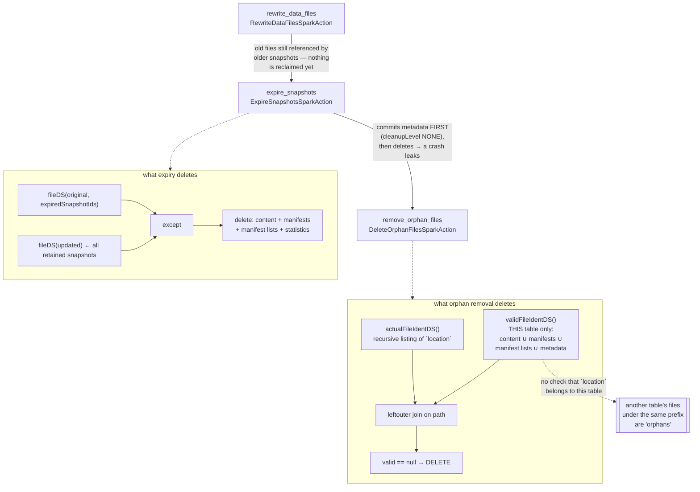

# Chapter 11.5 — Running it in production: maintenance procedures and their traps

**The question this chapter answers:** `rewrite_data_files`, `expire_snapshots`, `remove_orphan_files` — what order must they run in, what does each one actually delete, and which of the three can destroy a table that is not even its argument?

**Prerequisites:** Chapter 5.5 (the mechanism of all four maintenance actions), Chapter 3.3 (files exist before the commit that references them), Chapter 11.2 (`gc.enabled=false` and `add_files` aliasing), Chapter 11.4 (the conflict window compaction competes for)

**Source covered:** `spark/v3.5/.../actions/ExpireSnapshotsSparkAction.java`, `.../actions/DeleteOrphanFilesSparkAction.java`, `.../procedures/RemoveOrphanFilesProcedure.java`, `.../actions/BaseSparkAction.java`, `core/.../util/FileSystemWalker.java`, `core/.../actions/BinPackRewriteFilePlanner.java`

## 1. The problem

These are not three independent chores. They are one pipeline with a direction, and the direction falls out of what each job is able to *prove*.

- **Compaction creates garbage.** It writes new files and marks old ones replaced, but the old ones are still referenced by older snapshots. Nothing is reclaimed.
- **Expiry identifies garbage by set difference and deletes it** — but it commits the metadata change *before* it starts deleting, so a job that dies in between leaks.
- **Orphan removal is the only job that can clean that leak up**, because it is the only one that works by listing storage rather than by reading metadata. That is also exactly why it is the dangerous one.

Chapter 5.5 owns the mechanism of all four maintenance actions, these three included. This chapter is the operational view: the order, the arguments, and — for `remove_orphan_files` — an exact accounting of which safety checks the code performs and which it does not, because someone will point this at production storage.

!!! danger "Read section 6 before running `remove_orphan_files` against anything you care about"
    `DeleteOrphanFilesSparkAction` builds its "valid" set from **one** table and anti-joins it against **everything under a location**. It never checks that the location belongs to that table alone. Two tables under one warehouse prefix is a data-loss configuration, and nothing warns you.

!!! danger "None of this applies to a table in a Nessie catalog"
    Every procedure in this chapter reasons from **one table's snapshot history**. A Nessie repository has many branches, and a snapshot that is unreachable from one branch is current on another. `expire_snapshots` cannot see the other branches and will delete files they are still reading; `remove_orphan_files` has the same blind spot, one level down.

    Chapter 9.4 covers the mechanism and the replacement: Nessie's own `gc/` tools walk manifest entries of **every** status precisely because another branch may still need them. Do not run this chapter's runbook against a Nessie-backed table — read 9.4 instead.

## 2. The pipeline

**The ordering is operational, not enforced.** No code refuses to run these out of order. Run orphan removal before expiry and it simply finds less, because the files expiry would have freed are still referenced. Run expiry before compaction and you keep the un-compacted files alive in whatever snapshots you retained. The pipeline is a consequence of the mechanisms, and the rest of this chapter is those mechanisms.

## 3. Compaction, and the two defaults that decide whether it does anything

Compaction is the only one of the three that a reader is likely to run and see *no effect* from, so the selection rules matter operationally.

Selection happens twice — once per file, once per group — and the per-file rule is not about size alone.



Size is one of three. `outsideDesiredFileSizeRange` fires when a file falls outside `[0.75 × target, 1.80 × target]` — `MIN_FILE_SIZE_DEFAULT_RATIO` and `MAX_FILE_SIZE_DEFAULT_RATIO` — but a file sitting comfortably inside that window is still selected if it carries enough deletes. Of the two delete predicates only one is live out of the box: `delete-file-threshold` defaults to `Integer.MAX_VALUE`, and upstream says why in its javadoc — *"this feature is not enabled by default"* — while `delete-ratio-threshold` defaults to `0.3`, so any file with 30% of its rows deleted is a candidate at any size.

That is the rule to carry into Chapter 11.4's tables. On a merge-on-read table with a 512 MB target, a 500 MB data file is never selected on size and can be selected constantly on delete ratio; "compaction is about file size" predicts neither. It also inherits 5.5 §8's blind spot: only file-scoped delete files contribute a countable number, so the ratio predicate goes quiet on a table using partition-scoped deletes.

The surviving files are then bin-packed — `new BinPacking.ListPacker<>(maxGroupSize, 1, false, maxGroupCount)`, packed on `ContentScanTask::length` — and the resulting groups face a second filter. `filterFileGroups` keeps a group only if at least one of five predicates holds, and the five are not five new rules: `enoughInputFiles` (`size() > 1 && size() >= min-input-files`), `enoughContent` (`size() > 1 && inputSize > target`), `tooMuchContent` (`inputSize > maxFileSize`), and then **the same two delete predicates from the per-file gate**, re-applied over the group with `anyMatch`.

Note the `size() > 1` conjunct on the first two. A group of exactly one file can only survive on `tooMuchContent` or on deletes — so a single oversized-but-not-huge file, selected by `outsideDesiredFileSizeRange` at the first gate, is dropped at the second. Both gates read `rewriteAll` first: `planFileGroups` is `rewriteAll ? tasks : filterFiles(tasks)` followed by `rewriteAll ? groups : filterFileGroups(groups)`.

With a 512 MB target and no delete files, a partition holding four 1 MB files satisfies none of them — `enoughInputFiles` needs `min-input-files`, default `5`. A default `rewrite_data_files` reports zero rewritten files and leaves the partition exactly as it was.

Two other defaults are worth knowing before you schedule this:

`use-starting-sequence-number` defaults to `true`, and its javadoc says what it buys: *"If the compaction should use the sequence number of the snapshot at compaction start time for new data files … This avoids commit conflicts with updates that add newer equality deletes at a higher sequence number."* That is Chapter 11.4's conflict surface, pre-empted by a default. Chapter 5.5 §8 explains what turning it off costs: deleted rows reappear, with no error anywhere.

`partial-progress.enabled` defaults to `false` — one commit for the whole rewrite, and a single failed group loses everything. Enabling it produces up to `partial-progress.max-commits` (default `10`) separate commits, and the interface javadoc is explicit that this *"will not change the correctness of the rewrite operation as file groups can be compacted independently."* On a large table the choice is between one long conflict window and ten short ones — a scheduling decision, not a correctness one.

## 4. Expiry commits before it deletes



Read it as four moves.

1. `TableMetadata originalMetadata = ops.current()` — capture the world before.
2. `expireSnapshots.cleanupLevel(CleanupLevel.NONE).commit()` — perform the expiry as a **metadata-only** commit. The enum constant is documented as *"Skip all file cleanup, only remove snapshot metadata"*, and `cleanupLevel(CleanupLevel)`'s own javadoc — a different one — recommends it *"when data and metadata files may be more efficiently removed using a distributed framework through the actions API"*, which is precisely what this action is. That second javadoc names a third level, `METADATA_ONLY`, for tables whose data files are shared with something else; no Spark action or procedure exposes it, which is why Chapter 11.2 can say `add_files` leaves you with no interlock.
3. `ops.refresh()` and build `validFileDS` from the metadata that survived.
4. `deleteCandidateFileDS.except(validFileDS)` — a distributed set difference. `doExecute()` then streams or collects that and deletes.

The commit lands at step 2. Deletion is a separate distributed job at step 4. Kill the driver between them and the snapshots are gone from metadata while their files remain in storage — and re-running expiry will not find them, because those snapshots are no longer in `originalMetadata` to become delete candidates. Only orphan removal can.

That is not a bug. It is the only ordering that keeps the table correct: deleting first and committing second would, on a crash, leave a live snapshot pointing at files that no longer exist. Chapter 3.3's rule again — leaked storage is recoverable, a corrupted table is not. It is also the reason the third job exists at all.

The method's own javadoc is worth quoting because it is easy to misread the API: *"This does not delete data files. To delete data files, run `execute()`."* Calling `expireFiles()` for a preview has already committed the expiry.

## 5. Orphan removal reverses the direction of proof

Every other job in this book reasons forward from metadata: here is what the table references, therefore here is what must be kept. Orphan removal reasons backwards from storage: here is what exists, subtract what the table references, delete the remainder.



Four unions, and every one of them is `(table)` — the single `Table` handed to the action's constructor. `contentFileDS` and `manifestDS` read the `ALL_MANIFESTS` metadata table unfiltered, so they cover every snapshot still in table metadata, on every branch and tag, not just the current one. `manifestListDS` iterates `table.snapshots()`. `otherMetadataFileDS` is the current `metadata.json`, the entries in its metadata log, the version-hint file, and the statistics files.

That is a correct and generous valid set — **for one table**. Nothing in it is scoped to a location, and nothing anywhere asks whether some other table's files live under the location being listed.



The join is one line: `actualFileIdentDS.joinWith(validFileIdentDS, joinCond, "leftouter")`, keyed on normalised path, and everything with no match on the right is an orphan. The interesting code is the refusal underneath it — a `SetAccumulator` collects `(scheme, authority)` pairs that matched on path but differed on prefix, and under the default `PrefixMismatchMode.ERROR` the whole job throws instead of returning a result. Upstream's message ends with the sentence that should govern how you treat the option: *"'DELETE' iff you are ABSOLUTELY confident that remaining conflicting authorities/schemes are different. It will be impossible to recover deleted files."*

## 6. Exactly what protects you, and exactly what does not

This is the section to read twice. Everything in the left column is a check the code performs; everything in the right column is a check people assume it performs and it does not.







**The guarantees the code actually gives:**

| Guarantee | Where it is enforced | Exact reach |
|---|---|---|
| Refuses to run when `gc.enabled=false` | `ValidationException.check` in the action constructor: *"Cannot delete orphan files: GC is disabled (deleting files may corrupt other tables)"* | The argument table only. Default is `true`, so this fires only on a table someone marked — e.g. one created by `snapshot` (Chapter 11.2). |
| Never considers a file newer than the cutoff | listing predicates: `file.getModificationTime() < olderThanTimestamp` (Hadoop) and `fileInfo.createdAtMillis() < olderThanTimestamp` (prefix listing) | Filters candidates at listing time, before the join. Default cutoff is `now − 3 days`, a field initialiser on the action. |
| Aborts on scheme/authority mismatch rather than guessing | `PrefixMismatchMode.ERROR` default plus the `SetAccumulator` in `findOrphanFiles` | Only detects paths that match on the path component. `s3://b/x` vs `s3a://b/x` is caught; two genuinely unrelated prefixes are not "caught", they are simply both listed. |
| Normalises `s3n` and `s3a` to `s3` | `EQUAL_SCHEMES_DEFAULT = ImmutableMap.of("s3n,s3a", "s3")` | Those three schemes only. Every other equivalence must be declared via `equal_schemes` / `equal_authorities`. |
| Never deletes `_`- or `.`-prefixed paths | `PartitionAwareHiddenPathFilter.forSpecs(table.specs())` wrapping `HiddenPathFilter` in `FileSystemWalker` | Applied to every path component from the base directory down. Partition directories named after a field starting with `_` or `.` are exempted from the filter so their contents are still listed. |
| Protects files reachable from *any* retained snapshot | `validFileIdentDS()` unions unfiltered `contentFileDS` / `manifestDS` / `manifestListDS` / `otherMetadataFileDS` | Every snapshot in current table metadata, including branches and tags — which is why expiry must run first if you want anything reclaimed. |
| Refuses an interval under 24 hours | `RemoveOrphanFilesProcedure.validateInterval` | **The procedure only**, **only when `older_than` is explicitly passed**, and **skipped entirely when `spark.testing=true`**. |
| Lets you rehearse | `dry_run => true` sets `action.deleteWith(file -> {})` | The listing and the join still run; only the delete becomes a no-op. The returned rows are the files it *would* have deleted — **unless `stream_results` is on**; see the gotcha in section 8. |
| Lets you supply the candidate set yourself | `file_list_view => 'v'` calls `compareToFileList(spark().table(v))` | Replaces the *listing*, not the filters. The view must carry a `file_path` string column and a `last_modified` timestamp column, and both the location prefix and the age cutoff are still applied to it — see below. |

`file_list_view` is the guard this chapter tells you to reach for, so it is worth reading rather than trusting:



It replaces the listing and nothing else. The location prefix is still applied — and this is the **only** place in the whole action where `location` acts as a bound rather than as a starting point — and so is the age cutoff, against a `last_modified` column the view is required to carry. `compareToFileList` rejects a dataset whose `file_path` is not a string or whose `last_modified` is not a timestamp, so a bare list of paths will not do. The class javadoc says the same in one line: *"This skips the directory listing … using the same `Table#location()` and `olderThan(long)` filtering as above."* That makes it a stronger guard than a raw candidate list would be, and it means a view built from a stale inventory quietly loses rows to the cutoff rather than deleting something it should not.

**The checks that do not exist:**

- **No check that `location` belongs to the table.** `this.location = table.location()` in the constructor, and `location(String)` overwrites it with whatever you pass. There is no validation, no prefix comparison, no warning.
- **No check that another table has files under that location.** The valid set is built from one `Table`. A second Iceberg table under the same warehouse directory, a Hive table sharing the prefix, or an `add_files` source directory that happens to sit under the target's location (Chapter 11.2) all present as orphans.
- **No minimum interval on the Action API.** `olderThan(0)` is accepted. The procedure's own error message tells you how to bypass its floor: *"you can use the Action API to remove orphan files with an arbitrary interval."*
- **No consistency between the listing and the valid set.** The action does not refresh the table inside `doExecute`, and the listing runs against live storage. The timestamp cutoff is the *only* thing standing in for a consistent snapshot, and it is a wall-clock heuristic rather than a proof.
- **No protection for a `metadata.json` that has fallen out of the metadata log.** `otherMetadataFileDS(table)` calls `metadataFileLocations(table, /* recursive */ false)`, which is the current metadata file plus `metadata.previousFiles()`. Older metadata files trimmed by `write.metadata.previous-versions-max` are not in the valid set. That is correct for a normal table and wrong for one whose `metadata.json` someone pinned externally.

**What the source leaves genuinely ambiguous.** The cutoff compares against `FileStatus.getModificationTime()` or `FileInfo.createdAtMillis()`, and Iceberg takes whichever number the filesystem implementation reports at face value. Whether that number means "when the writer finished this file" is a property of your object store and its Hadoop connector, not of this code — a copy, a restore from a lifecycle tier, or a re-upload can reset it. If your storage does not preserve original write times through whatever operations your platform performs, the cutoff is weaker than it looks and this code cannot tell.

## 7. The runbook

| Step | Procedure | What drives the frequency | The trap |
|---|---|---|---|
| 1 | `rewrite_data_files` | file count per partition (Chapter 11.3) | conflicts with in-flight merge-on-read merges via `validateDataFilesExist` (Chapter 11.4); schedule outside write windows |
| 2 | `expire_snapshots` | `history.expire.max-snapshot-age-ms` (5 days), `history.expire.min-snapshots-to-keep` (1) | commits before deleting; a crash between the two leaks, and re-running will not find the leak |
| 3 | `remove_orphan_files` | leak rate from failed jobs and unknown-state commits | `location` scoping, the `older_than` window, `gc.enabled`, prefix mismatch — section 6 |
| — | `rewrite_manifests` | manifest count and planning latency | **no position in the order.** It only regroups references between manifests and never removes a content-file entry, so it creates no garbage for expiry to find and changes nothing orphan removal can reach. Run it whenever. It is still a commit that can lose a race (Chapter 5.5 §7) |

Two of those procedures are called `rewrite_*` and they are not the same kind of thing, which is worth stating outright because the shared prefix implies otherwise. **"Rewrite" carries three senses in this book.** Chapter 11.4's is copy-on-write *rewriting data files that contain a matched row* — a consequence of a `MERGE`, not a maintenance job at all. `rewrite_data_files` is compaction: it replaces data files with different data files, and it is the only one of the three that creates garbage. `rewrite_manifests` replaces *manifests* and touches no data file, so it creates none. So the first two rewrite the same *thing* — data files — for unrelated reasons, and the third rewrites something else entirely. Only the middle one is what this chapter has been calling compaction, and only the middle one belongs in the ordering below.

The last row is unnumbered deliberately. Three of these are a pipeline and one is a chore, and it would be easy to read a four-row table as a four-step sequence — but nothing in section 2's derivation applies to `rewrite_manifests`, because nothing it does changes what the other three are able to prove.

Steps 1 and 2 both take table-level commits, so both compete with your writers. Step 3 takes no commit at all — it only deletes — which is why it is the one job that can do damage without any evidence appearing in the table's history.

## 8. Gotchas

!!! danger "`remove_orphan_files` will delete another table's data if they share a prefix"
    `validFileIdentDS()` is four unions over the single argument table; `actualFileIdentDS()` is a recursive listing of `location`, which defaults to `table.location()` and is overridden without validation by the `location` argument. There is no ownership check in either direction. Two Iceberg tables under one warehouse directory, a Hive table sharing the prefix, an `add_files` source directory beneath the target's location — every one is a data-loss scenario and none of them raises a warning. Before pointing this at a shared prefix, use `file_list_view` to supply a candidate set you control, or run with `dry_run => true` and read every row — with `stream_results` off, for the reason below.

!!! danger "The 24-hour floor is on the procedure, not on the action"
    `validateInterval` throws below 24 hours with the reason spelled out — *"Executing this procedure with a short interval may corrupt the table if other operations are happening at the same time"* — and then names the bypass in the same message. `DeleteOrphanFilesSparkAction` enforces no minimum at all; its default is a field initialiser of `now − 3 days`. The floor is also skipped when `spark.testing` is true, and skipped when `older_than` is omitted — though that second case is not a hole: omitting the argument leaves the action's own three-day default in force, which is seventy-two times wider than the floor it skipped. The hole is the first sentence. Any tooling that calls the action directly has silently opted out of the guardrail. The window must be wide because `SnapshotProducer` writes data files, manifests and the manifest list *before* the commit that references them (Chapter 3.3): an in-flight write always has valid files that no snapshot can reach yet.

!!! danger "`stream_results` silently truncates the row set you were told to read"
    The rehearsal this chapter recommends — `dry_run => true`, then read every returned row — rests on the result listing every file. `stream_results => true` breaks that. `deleteFiles` sizes its output list to `MAX_ORPHAN_FILE_SAMPLE_SIZE`, default `20000`, and `collectPathsForOutput` fills it only up to that cap when streaming; `RemoveOrphanFilesProcedure.toOutputRows` then builds its rows from `result.orphanFileLocations()` and nothing else, so the procedure's only output column stops at 20 000 paths. Upstream says it in the class javadoc — *"When enabled, the result will contain only a sample of file paths (up to 20000). The total count of deleted files is logged but not included in the result."* The action carries the real number in `orphanFilesCount`, and the procedure's output type has no column for it, so from SQL there is no signal at all that you are looking at a sample. The parameter defaults to `false`, which is what keeps the advice safe out of the box; the failure mode is a large run where someone turned it on for driver memory and kept treating the rows as exhaustive. If you need both — a set too large for the driver and a reviewable list — use `file_list_view` to bound the candidates instead.

!!! warning "A crashed `expire_snapshots` has already committed"
    `cleanupLevel(CleanupLevel.NONE).commit()` runs before a single file is deleted. Kill the job between the commit and the delete phase and the snapshots are gone from metadata while their files remain. Re-running expiry will not find them — they are no longer in `originalMetadata`. Only orphan removal can, which is the operational reason the pipeline order is not negotiable.

!!! warning "A `snapshot`-created table cannot run either cleanup job — on purpose"
    The `gc.enabled` `ValidationException.check` in `DeleteOrphanFilesSparkAction`'s constructor is duplicated in `ExpireSnapshotsSparkAction` and in `RemoveSnapshots` (Chapter 5.5 §5). Chapter 11.2 showed `SnapshotTableSparkAction.destTableProps` setting `gc.enabled=false`, because a snapshot table indexes the *source* table's data files. Setting it to `true` to make the error go away deletes the production source table's data. If a snapshot table has served its purpose, drop it.

!!! warning "Prefix mismatch defaults to failing the job, and `DELETE` mode is irreversible"
    When metadata says `s3://bucket/…` and the listing says `s3a://bucket/…`, every file looks orphaned. The accumulator fills and the job aborts rather than guess. Resolve it with `equal_schemes` / `equal_authorities` — declaring the two prefixes equivalent — not with `prefix_mismatch_mode => 'DELETE'`, which upstream qualifies with *"iff you are ABSOLUTELY confident"* and *"It will be impossible to recover deleted files."*

!!! note "Hidden paths are out of scope in both directions"
    The filter is applied by two different mechanisms. Under the default Hadoop listing, `FileSystemWalker` hands it straight to `fs.listStatus(path, pathFilter)` at every level, so a hidden directory is never descended into. Under prefix listing — `prefix_listing => true`, which lists flat — there are no levels to filter, so `isHiddenPath` walks each candidate back up to the base directory instead and rejects it if any component fails `HiddenPathFilter`, which is `!name.startsWith("_") && !name.startsWith(".")`. That is a safety property: `_SUCCESS`-style markers and anything under a `_`-prefixed directory are never deleted. It is also a limitation: garbage that happens to live under such a name is never reported as an orphan either, so a storage-usage figure and this job's output can disagree indefinitely. The one exception is a partition directory named after a field starting with `_` or `.`, which `PartitionAwareHiddenPathFilter` exempts so that real partition data below it is still listed.

!!! note "Delete failures are logged, not raised"
    `deleteNonBulk` runs with `.noRetry().suppressFailureWhenFinished().onFailure((file, exc) -> LOG.warn(...))`, and `deleteBulk` catches `BulkDeletionFailureException` and logs *"Deleted only {} of {} files using bulk deletes"*. The result rows report the files the job *identified*, not the files it succeeded in removing — and under `stream_results` not even all of those, per the cap above. A run that reports 40 000 orphans and silently failed on half of them looks identical to a clean run in the procedure's output.

## Key takeaways

- The three jobs form a pipeline — compact, expire, remove orphans — and the direction comes from what each can prove. Nothing in the code enforces the order.
- Compaction's defaults are conservative enough to do nothing: a group is rewritten only if one of five predicates holds, and `min-input-files` defaults to 5.
- `expire_snapshots` commits the metadata change with `CleanupLevel.NONE` and deletes afterwards. A crash in between leaks files that expiry can never find again.
- `remove_orphan_files` is the only job that reasons from storage rather than metadata, and its valid set covers exactly one table while its candidate set covers an entire location.
- Its real safety checks are: `gc.enabled`, the timestamp cutoff applied during listing, `PrefixMismatchMode.ERROR`, the `s3n`/`s3a` → `s3` normalisation, and the hidden-path filter. Its 24-hour floor exists only in the procedure, only when `older_than` is passed, and not when `spark.testing` is set.
- It performs no ownership check on `location` whatsoever. `dry_run` and `file_list_view` are the two mechanisms the code gives you for bounding that — and `dry_run`'s row set is exhaustive only while `stream_results` is off, which is the default.

## Source map

| What | File |
| --- | --- |
| `expire_snapshots` | [`.../actions/ExpireSnapshotsSparkAction.java`](https://github.com/apache/iceberg/blob/apache-iceberg-1.11.0/spark/v3.5/spark/src/main/java/org/apache/iceberg/spark/actions/ExpireSnapshotsSparkAction.java), [`.../procedures/ExpireSnapshotsProcedure.java`](https://github.com/apache/iceberg/blob/apache-iceberg-1.11.0/spark/v3.5/spark/src/main/java/org/apache/iceberg/spark/procedures/ExpireSnapshotsProcedure.java) |
| `remove_orphan_files` | [`.../actions/DeleteOrphanFilesSparkAction.java`](https://github.com/apache/iceberg/blob/apache-iceberg-1.11.0/spark/v3.5/spark/src/main/java/org/apache/iceberg/spark/actions/DeleteOrphanFilesSparkAction.java), [`.../procedures/RemoveOrphanFilesProcedure.java`](https://github.com/apache/iceberg/blob/apache-iceberg-1.11.0/spark/v3.5/spark/src/main/java/org/apache/iceberg/spark/procedures/RemoveOrphanFilesProcedure.java) |
| Reachable-file sets shared by both | [`.../actions/BaseSparkAction.java`](https://github.com/apache/iceberg/blob/apache-iceberg-1.11.0/spark/v3.5/spark/src/main/java/org/apache/iceberg/spark/actions/BaseSparkAction.java), [`core/.../ReachableFileUtil.java`](https://github.com/apache/iceberg/blob/apache-iceberg-1.11.0/core/src/main/java/org/apache/iceberg/ReachableFileUtil.java) |
| Listing and the hidden-path filter | [`core/.../util/FileSystemWalker.java`](https://github.com/apache/iceberg/blob/apache-iceberg-1.11.0/core/src/main/java/org/apache/iceberg/util/FileSystemWalker.java) |
| `rewrite_data_files` | [`.../actions/RewriteDataFilesSparkAction.java`](https://github.com/apache/iceberg/blob/apache-iceberg-1.11.0/spark/v3.5/spark/src/main/java/org/apache/iceberg/spark/actions/RewriteDataFilesSparkAction.java) |
| Compaction thresholds and options | [`core/.../actions/SizeBasedFileRewritePlanner.java`](https://github.com/apache/iceberg/blob/apache-iceberg-1.11.0/core/src/main/java/org/apache/iceberg/actions/SizeBasedFileRewritePlanner.java), [`core/.../actions/BinPackRewriteFilePlanner.java`](https://github.com/apache/iceberg/blob/apache-iceberg-1.11.0/core/src/main/java/org/apache/iceberg/actions/BinPackRewriteFilePlanner.java), [`api/.../actions/RewriteDataFiles.java`](https://github.com/apache/iceberg/blob/apache-iceberg-1.11.0/api/src/main/java/org/apache/iceberg/actions/RewriteDataFiles.java) |
| Expiry and GC defaults | [`core/.../TableProperties.java`](https://github.com/apache/iceberg/blob/apache-iceberg-1.11.0/core/src/main/java/org/apache/iceberg/TableProperties.java) |

!!! note "Spark 4 differences"
    The actions are effectively unchanged across v3.5, v4.0 and v4.1. The procedure classes in v4.x implement Spark 4's `BoundProcedure` API — `bind(StructType)` and `Iterator<Scan> call(…)` instead of `parameters()` / `outputType()` / `InternalRow[] call(…)` — and each declares a `static final String NAME`. Argument names, defaults, and every safety check quoted in this chapter are identical.

**Next:** nothing — this is the last chapter. Every job here exists to protect one invariant from Chapter 3.4: the table is whatever its single catalog entry says it is, and a file is safe exactly as long as some retained snapshot can reach it. Compaction, expiry and orphan removal are three different ways of being careful about that, and the only one that can violate it is the one that never reads the catalog at all.
